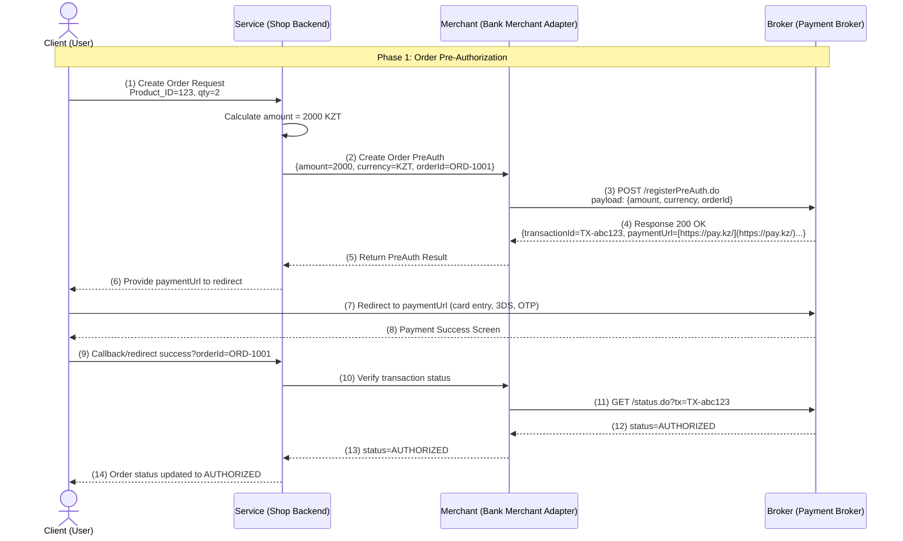
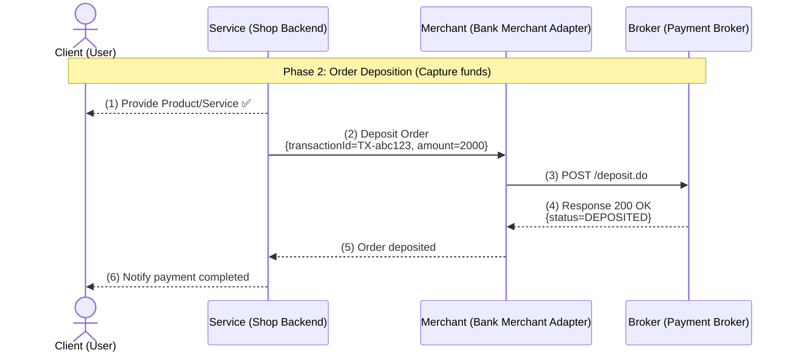
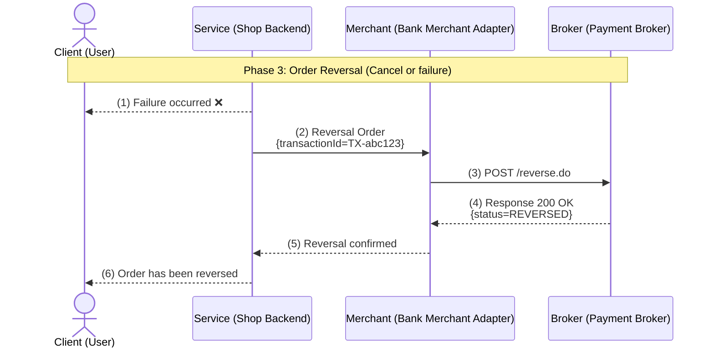

# Сервис Платежей

Сервис для обработки **создания платежей, авторизации, депозита, возврата, реверса** и отслеживания статусов. Поддерживает работу с разными брокерами и банками.

---

## Возможности

✅ Создание, авторизация, депозит, возврат и реверс платежей  
✅ Отслеживание статуса и истории платежей  
✅ REST & gRPC API через gRPC-Gateway  
✅ Эндпоинт HealthCheck для проверки базы данных и брокера  
✅ Поддержка произвольных метаданных для платежей  

---

## Обзор API

- **Base URL:** `http://localhost:8080`  
- **Secured URL:** `https://localhost:8080`  
- **Спецификация:** OpenAPI 3.0 (можно сгенерировать из proto через grpc-gateway)

### Основные эндпоинты

| Метод | Эндпоинт                        | Описание                                    |
|-------|---------------------------------|---------------------------------------------|
| POST  | `/v1/payments`                  | Создание платежа                            |
| POST  | `/v1/payments/auth`             | Авторизация платежа                         |
| POST  | `/v1/payments/deposit`          | Депозит (списание средств)                  |
| POST  | `/v1/payments/refund`           | Возврат средств                             |
| POST  | `/v1/payments/reversal`         | Реверс платежа (отмена или ошибка)         |
| GET   | `/v1/payments/{payment_id}`     | Получение информации о платеже             |
| GET   | `/v1/payments/{payment_id}/status` | Получение текущего статуса платежа      |
| POST  | `/v1/payments/success`          | Пометить платеж как успешный               |
| GET   | `/v1/payments`                  | Список платежей (с пагинацией)             |
| GET   | `/v1/health`                    | Проверка состояния сервиса                  |

---

## Настройка

### 1️⃣ Настройка PostgreSQL

Создайте базу данных PostgreSQL, соответствующую настройкам в `.env` перед запуском сервиса.

---

### 2️⃣ Файл конфигурации `.env`

Пример `.env`:

```env
# Конфигурация сервера
GRPC_MAX_MESSAGE_SIZE_MIB=12
GRPC_MAX_CONNECTION_AGE=30s
GRPC_MAX_CONNECTION_AGE_GRACE=10s
GRPC_PORT=5433
LEVEL=debug # debug | prod | dev

# Настройки базы данных
DB_HOST=localhost
DB_PORT=5432
DB_NAME=paymentServiceDB
DB_USER=Bacoonti
DB_PASSWORD=SuperSecretPassword
POSTGRES_MAX_OPEN_CONN=25
POSTGRES_MAX_IDLE_TIME=15m

# API Банка Bereke
BEREKE_MERCHANT_LOGIN=SuperSecretLogin
BEREKE_MERCHANT_PASSWORD=SuperSecretPassword
BEREKE_MERCHANT_MODE=TEST
```


##  🎨 Визуализация процесса оплаты
Ниже приведена последовательность действий между клиентом, сервисом, банком (Merchant Adapter) и брокером платежей. Диаграммы разделены на три фазы.

**Фаза 1: Предавторизация заказа:**



**Фаза 2: Депозит заказа (списание средств)**



**Фаза 3: Реверсирование заказа (отмена или сбой)**

